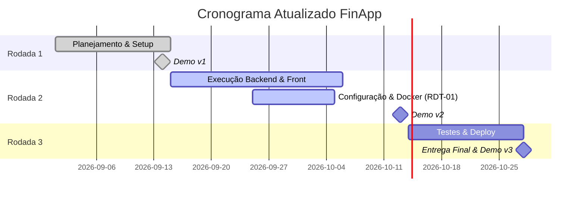

# Cronograma (Gantt) e Orçamento — Atualização Rodada 2

**Responsável:** Filipe (GP)

## 1. Cronograma Atualizado (Gantt)

O cronograma foi readequado para refletir a consolidação e aprovação dos módulos RF01 (Transações) e RF02 (Categorias). A entrega do RF03 (Relatório) foi puxada para frente (entrega parcial adiantada), garantindo margem de tempo para focar em Testes e Deploy na Rodada 3. O impacto de tempo causado pela adoção do Docker (RDT-01) foi contornado pelo paralelismo da equipe.

## 2. Orçamento Atualizado (Pós RDT-01)

- **Baseline Original:** 612 horas | Orçamento: R$ 30.600 (R$ 50/h).
- **Impacto da RDT-01:** Aproximadamente +8h extras divididas entre infraestrutura e documentação de contêineres Docker/PostgreSQL.
- **Orçamento Externo Variável:** R$ 0,00. As horas foram reabsorvidas dentro da capacidade do time, sem contratação externa.
- **Estimativa no Término (EAC):** Ajustada para ~624,5 horas ou **R$ 31.225**. O desvio de R$ 625 (2%) encontra-se dentro do contingenciamento aceitável e deve estabilizar na Iteração 3 devido à superação da curva de aprendizado.
